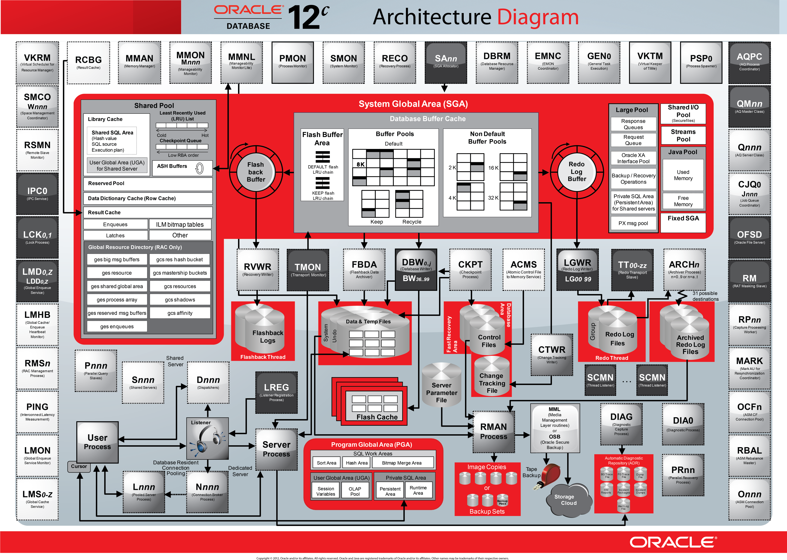

# Oracle DBMS 아키텍처

## 아키텍처 이해의 필요성
DBMS는 데이터베이스를 관리하고 운영한다.  
DBMS의 아키텍처의 구조, 구성요소, 동작 방식에 대한 이해가 바탕이 되어야만 데이터베이스의 성능 품질을 진단하고 이상현상을 통제할 수 있다.  
## 아키텍처를 이해했을 때 얻을 수 있는 장점
* Oracle DBMS 외 다른 DBMS의 경우도 아키텍처가 유사하기 때문에 쉽게 이해하는것이 가능해진다.
* 아키텍처의 기본적인 구조는 자주 변경되지 않는다. 따라서 새로운 버전의 DBMS가 나오는 경우 쉽게 학습이 가능하다.
* 성능 문제가 발생하는 경우 아키텍처 구조적으로 접근해 문제를 판단하고 해결할 수 있다.
DBA가 알아야 할 복잡한 아키텍처 대신 개발자 관점에서 알아야 할 내용만 담은 추상화 된 DBMS아키텍처를 가지고 공부해보려고 한다.

## 1. Oracle DBMS의 구조
Oracle DBMS는 크게 Instance와 Database로 구성된다.  
Instance와 Database는 다시 아래와 같이 분류된다.
* Instance
  * SGA
   * Shared Pool
   * Data Buffer Cache
   * Redo Log Buffer Cache
  * Background Processes
   * User Process
   * Server Process
* Database
  * Data files
  * Control files
  * Redo log files

### Instance  
인스턴스는 사례, 요소, 실재 라는 사전적 의미를 가진다.  
자바에서 클래스를 인스턴스화 시킬 때 비로소 실제 메모리에 할당되어 사용 가능한상태가 되어 작동하는 것을 생각하면 된다.  
Oracle DBMS에서도 마찬가지로 디스크에 저장된 데이터들이 사용이 가능해 지려면 메모리를 할당받아야 하는데, 메모리(SGA)와 프로세스를(Background Process)를 인스턴스라고 한다.  

### Database
2가지 의미를 나타낸다.  
1. 흔히 알고 있는 데이터 저장소를 아우르는 개념  
2. 디스크에 저장되는 실제 파일들
# 1. 유저프로세스와 서버 프로세스

## 유저프로세스
SQL을 보내는 모든 것들이다. SQL Developer, Toad, Sql 구현한 자바 앱 등등... SQL을 Send 하는것들을 칭한다.

## 서버프로세스
유저프로세스가 보낸 SQL을 처리하는 프로세스이다.
커넥션, 리스너 개념을 추가로 설명해야함.
서버프로세스는 SQL을 Parsing, Excute, Fetch 하는 과정을 수행한다.  
PGA 라는 메모리영역을 지니고 있으며, 커넥션마다 PGA영역을 만들게된다.  
따라서 여러 커넥션을 유지한다면 계속해서 DBMS가 메모리영역을 개설해줘야 하기때문에 부담이 늘어나게되고 이러한 이유로 커넥션 풀을 활용한다.
커넥션풀을 활용해 커넥션 횟수를 줄이고 메모리 자원을 아낄 수 있기 때문이다.
## SGA(System Global Area)
DBMS의 메모리 영역이다.

